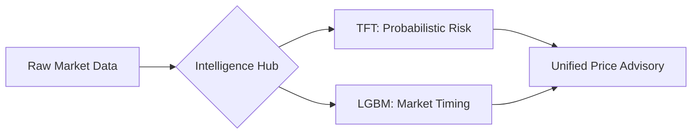
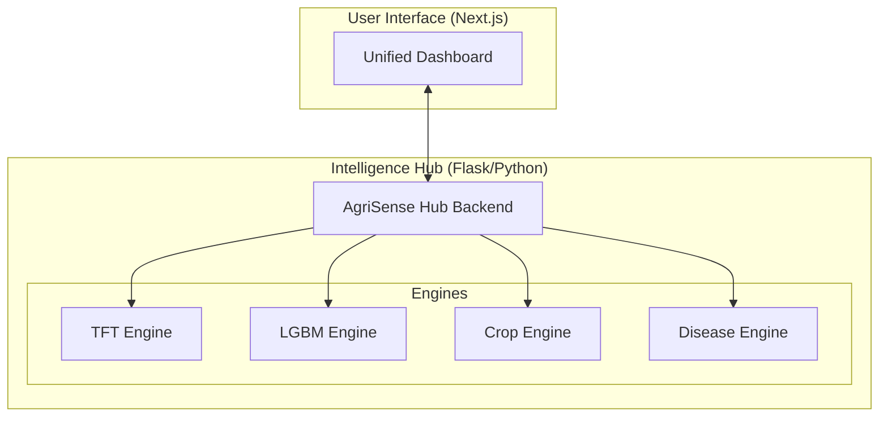

# 🌾 AgriSense Intelligence Hub: Executive Summary
## *Hybrid AI Framework for Precision Agriculture & Market Intelligence*

---

> [!IMPORTANT]
> **Production Status:** Deployment-Ready (Phase 3 Finalized)  
> **Key Metric:** 96.15% Accuracy on 14-Day Price Forecasting (TFT Epoch 15)  
> **Architecture:** Decoupled Modular Engines (LGBM, TFT, CNN, GBDT)

---

## 1. Project Vision & Problem Statement
The volatility of agricultural mandis (markets) creates significant financial risk for Indian farmers. **AgriSense AI** solves this by providing a unified intelligence layer that bridges the gap between **Price Prediction**, **Ecological Suitability**, and **Biological Risk**.

---

## 2. Core Technological Tracks

### A. The "Data-Rich" Forecasting Track (Prices)
We utilize a dual-model strategy to handle the high variance in commodity prices:
- **Primary Engine (TFT):** The Temporal Fusion Transformer captures long-range dependencies and provides Quantile corridors (Risk Intervals).
- **Secondary Engine (LightGBM):** Optimized with **GOSS/EFB** for ultra-fast point-prediction and iterative 14-day market timing.

### B. The "Ecological" Intelligence Track (Crop & Disease)
- **Crop Recommendation:** A leaf-wise GBDT classifier using 45 high-dimensional soil-climate synergies.
- **Disease Detection:** A Transfer Learning pipeline using **EfficientNet-B0** with **Grad-CAM** interpretability for early-warning risk signals.

---

## 3. Production Milestones (Phase 3)

| Milestone | Achievement | Technical Detail |
| :--- | :--- | :--- |
| **Model Parity** | **96.15% Accuracy** | Validated on Epoch 15 of the Heavy-TFT architecture. |
| **Feature Density** | **70+ Markers** | Included Fourier Seasonality and NASA Weather Shocks. |
| **Interpretability** | **Grad-CAM Enabled** | Visual auditing of biological disease triggers. |
| **Infrastructure** | **Modular Engines** | Decoupled `Engines/` directory for collaborative scaling. |

---

## 4. System Architecture Overview
The system is built on a **Modular Micro-Engine Architecture**, allowing each AI module to function independently while feeding into a unified API/Backend.

---

## 5. Technical Callouts
> [!TIP]
> **Quantile Forecasting:** Our TFT model doesn't just predict a price; it predicts a *range*. This allows farmers to understand the "Worst Case" and "Best Case" scenarios, providing true financial insurance.

> [!NOTE]
> **Data Scarcity Strategy:** For the Plant Disease and Crop modules, we utilize specialized datasets (2.2k and 38-class) to act as **Biological Feasibility Indicators**, ensuring high benchmark accuracy while maintaining realistic field expectations.

---

## 6. Future Roadmap
- **Hyper-Local Expansion:** Integration of village-level weather stations.
- **Continuous Learning:** Incremental LightGBM updates without full retraining.
- **Edge Deployment:** Quantized model deployment for offline mobile use.

---
*AgriSense Intelligence Hub — Precision Agriculture through Hybrid Intelligence.*
