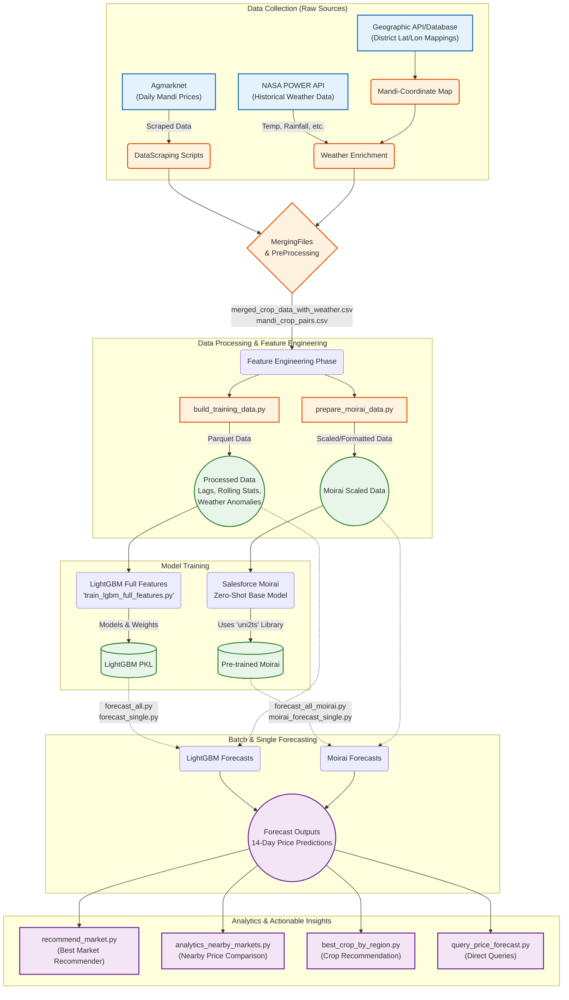

# Hybrid-AgriPrice-Forecaster Architecture Flow

Based on a detailed scan of the repository, here is the comprehensive structural overview and architectural flow of the Hybrid-AgriPrice-Forecaster project.

## 1. System Architecture Diagram

---

## 2. Component Breakdown

### 2.1. Ingestion / Data Collection Pipeline
- `DataScraping/`: Contains the logic used to ping and systematically scrape **Agmarknet** day-by-day.
- **Geospatial Mapping**: Raw Mandi districts are fused with Latitude/Longitude coordinates so they can communicate seamlessly with weather APIs.
- **Weather Enrichment**: Utilizing the exact coordinates, the pipeline pulls deeply granular metrics (temp bounds, solar radiation, humidity, rainfall) from the **NASA POWER API**.
- `MergingFiles/` & `DataPreProcessing/`: Cleans overlapping datasets and outputs the foundation: `merged_crop_data_with_weather.csv`.

### 2.2. Feature Engineering & Preparation Stack (`scripts/`)
- `build_training_data.py`: Handles massive dimensionality expansion for ML (expanding ~20 variables to 70+). Calculates time/seasonal embeddings, 1-30 day lag prices, localized market volatility, and rolling statistical means.
- `prepare_moirai_data.py`: Tailors and scales inputs specifically to comply with the architectural requirements of the unified time-series (`uni2ts`) inputs for Salesforce Moirai.

### 2.3. Model Training Ecosystem
- **Primary Architecture (LightGBM)**: Uses `train_lgbm_full_features.py` to compile the decision tree ensemble model (`price_lgbm_full_features.pkl`). Currently achieving the strongest predictive metrics against the test set constraints (~90.3% SMAPE Inv).
- **Secondary/Experimental (Salesforce Moirai)**: Integrates with the `uni2ts` subdirectory to execute a state-of-the-art transformer foundation model acting entirely on zero-shot inference (no direct downstream fine-tuning).

### 2.4. Forecasting Block
- Utilizes `forecast_all.py` and `forecast_all_moirai.py` to batch traverse through `mandi_crop_pairs.csv` mapping arrays. Outputs high-fidelity, 14-day future horizon models stored directly into the `outputs/forecasts/` directory logic.

### 2.5. Consumer & Analytics Layer
Abstracts the mathematical forecasts into real-world insights:
- **`recommend_market.py`**: Tells a farmer exactly where they should route their supply for max profit locally.
- **`analytics_nearby_markets.py`**: Helps contrast current spikes & historical baselines against neighboring geographic centers.
- **`best_crop_by_region.py`**: Evaluates which of the "Top 10" designated crops yield the safest/highest price trajectory organically depending on the spatial coordinates.

---

## 3. Top 10 Target Strategy Framework
The entire pipeline isn't just a brute-force approach on every single Indian commodity format. By architecture design, it actively partitions against specific behaviors:
1. **High Volatility Items**: Onion, Tomato (Excellent anomalous spike testing).
2. **Standard MSP Staples**: Wheat, Rice (Robust baseline cycle testing).
3. **Oil/Secondary**: Mustard, Groundnut, Potato, Chili, Banana, Watermelon.
